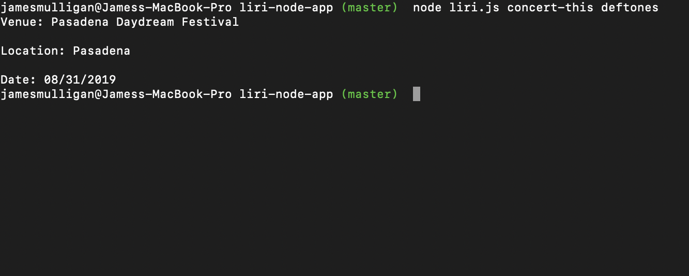
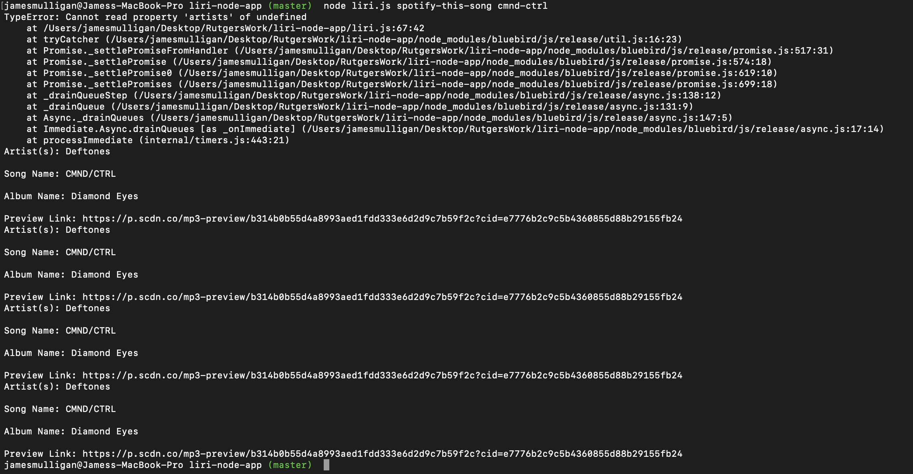
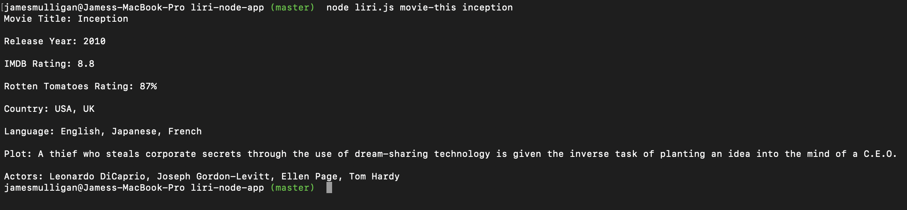
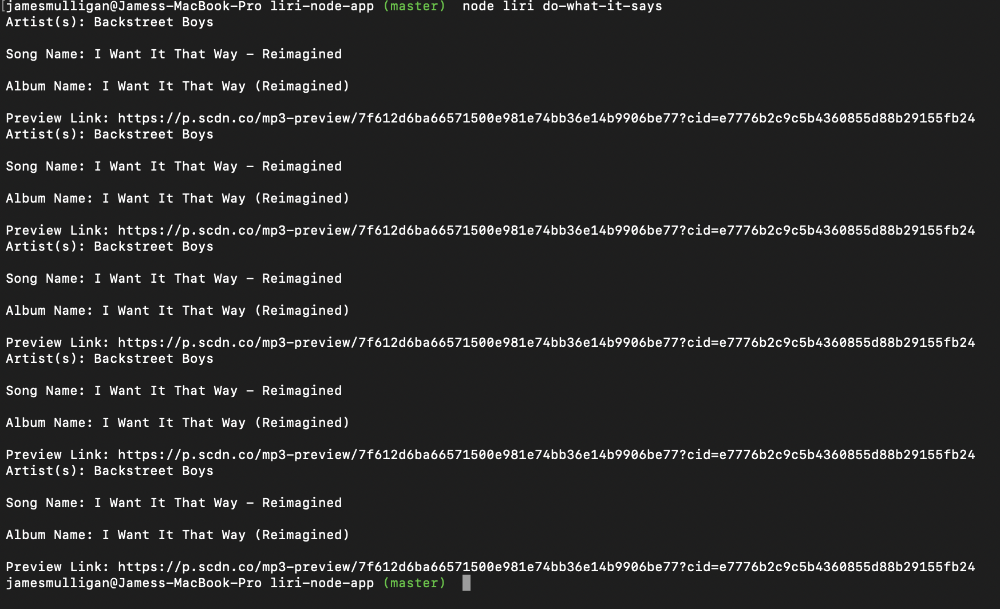

# LIRI-Bot

## Overview

LIRI is like iPhone's SIRI. However, while SIRI is a Speech Interpretation and Recognition Interface, LIRI is a _Language_ Interpretation and Recognition Interface. LIRI will be a command line node app that takes in parameters and gives you back data.

LIRI will search Spotify for songs, Bands in Town for concerts, and OMDB for movies.

Send requests using the `axios` package to the Bands in Town, Spotify and OMDB APIs.

### How to use this app

Use `concert-this` to use the bands in town api.
Use `movie-this` to search the omdb database.
Use `spotify-this-song` to find a song on spotify.
Use `do-what-it-says` to use a random function.

